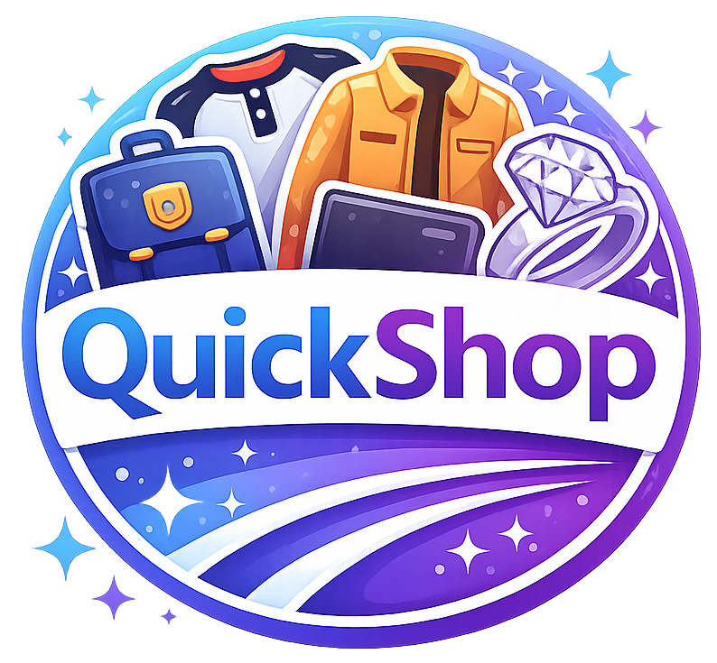
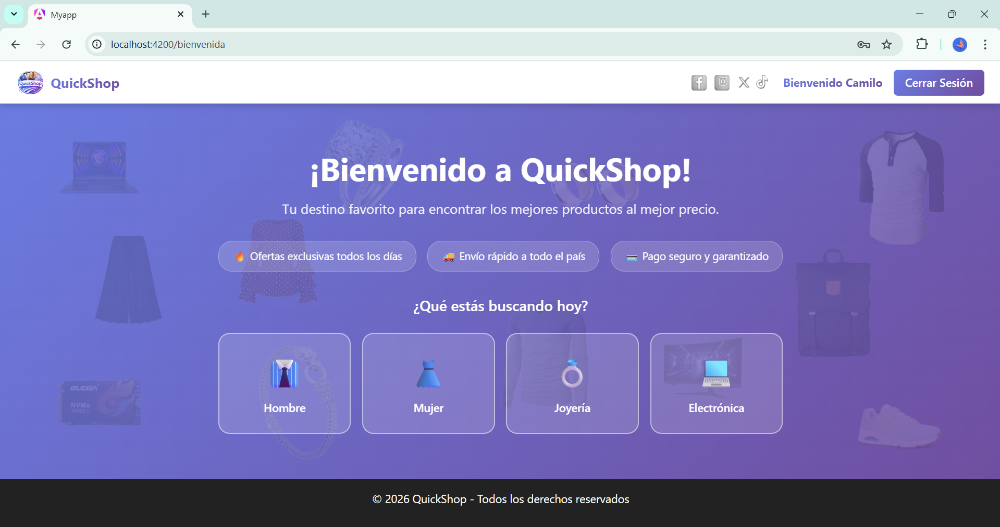
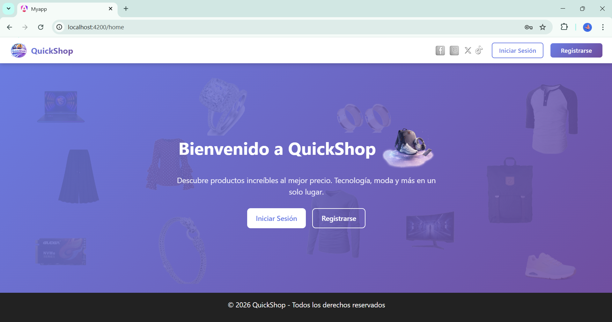
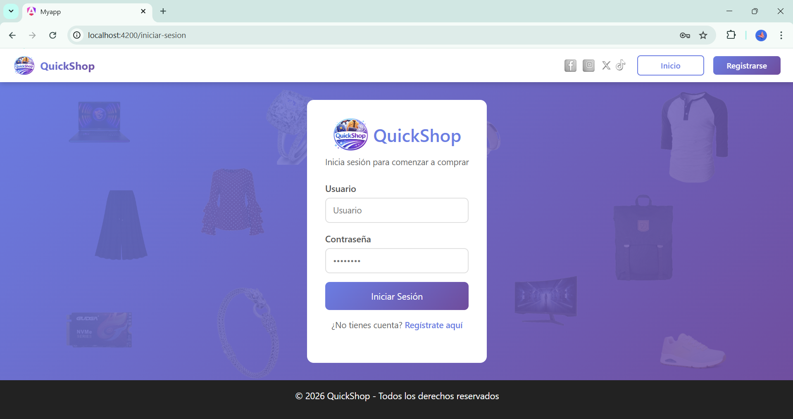
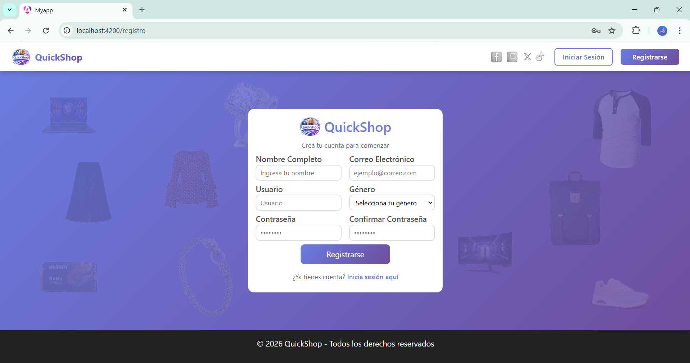
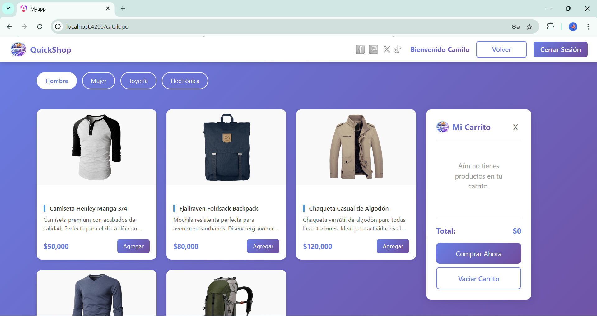
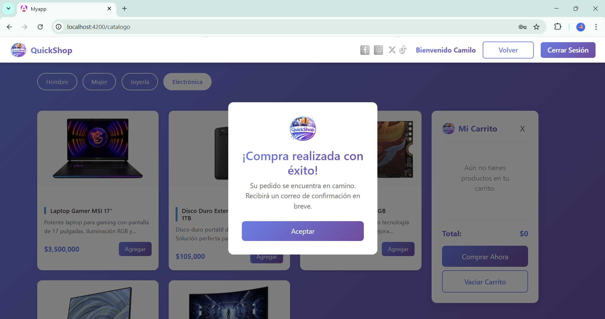

<div align="center">



# QuickShop Angular

**Aplicación web de comercio electrónico desarrollada con Angular 21 y Bootstrap 5**

[](https://angular.dev/)
[](https://getbootstrap.com/)
[](https://www.typescriptlang.org/)
[](https://github.com/JohanaS77/proyecto-angular)

</div>

---

## 📑 Índice

- [Descripción](#-descripción)
- [Capturas de Pantalla](#-capturas-de-pantalla)
- [Características Principales](#-características-principales)
- [Tecnologías Utilizadas](#️-tecnologías-utilizadas)
- [Arquitectura y Componentes](#-arquitectura-y-componentes)
- [Estructura del Proyecto](#-estructura-del-proyecto)
- [Instalación y Uso](#️-instalación-y-uso)
- [Funcionalidades Técnicas Clave](#-funcionalidades-técnicas-clave)
- [Mejoras Futuras](#-mejoras-futuras)
- [Desarrolladores](#-desarrolladores)

---

## 📖 Descripción

QuickShop Angular es una aplicación web de comercio electrónico moderna y responsive que simula una tienda virtual completa. Permite a los usuarios explorar un catálogo de productos organizado por categorías, gestionar un carrito de compras persistente y autenticarse en la plataforma.

El proyecto fue desarrollado en el marco de la asignatura **Desarrollo de Software Web Front-End** del programa de formación del SENA, aplicando los fundamentos de Angular y Bootstrap vistos durante el curso. Se utilizaron las características más modernas de Angular 21, incluyendo componentes standalone, Signals para el manejo de estado reactivo y una arquitectura limpia orientada a la escalabilidad.

---

## 📸 Capturas de Pantalla

### 🏠 Bienvenida


### 🏡 Home


### 🔐 Iniciar Sesión


### 📝 Registro


### 🛍️ Catálogo de Productos


### 🛒 Compra Exitosa


---

## 🚀 Características Principales

### 🔐 Autenticación de Usuarios
- Inicio de sesión con validación de formularios
- Persistencia de sesión mediante `localStorage`
- Control de acceso a la aplicación
- Servicio de autenticación (`AuthService`) inyectable en toda la app

### 🛍️ Catálogo de Productos
- Visualización de productos en tarjetas responsive
- Filtrado por categorías: Hombre, Mujer, Joyería, Electrónica
- Carga dinámica de productos mediante servicio
- Diseño limpio con Bootstrap

### 🛒 Carrito de Compras
- Agregar y eliminar productos
- Control de cantidades por ítem (aumentar / disminuir)
- Cálculo automático del total en tiempo real
- Persistencia del carrito con `localStorage`
- Panel deslizable con visibilidad controlada por Signals

### 🎨 Diseño y Experiencia de Usuario
- Interfaz moderna, amigable y responsive
- Compatible con móvil, tablet y desktop
- Componentes reutilizables y modulares
- Navbar dinámico con contador de ítems del carrito

---

## 🛠️ Tecnologías Utilizadas

| Tecnología | Versión | Uso |
|---|---|---|
| Angular | 21 | Framework principal |
| TypeScript | 5 | Lenguaje de programación |
| Bootstrap | 5 | Estilos y maquetación responsive |
| HTML5 | — | Estructura de vistas |
| CSS3 | — | Estilos personalizados |
| Angular Signals | built-in | Manejo de estado reactivo |
| LocalStorage API | built-in | Persistencia de datos |

---

## 🧩 Arquitectura y Componentes

El proyecto supera el requerimiento académico mínimo de 4 componentes, implementando una arquitectura modular y escalable con **9 componentes standalone**.

### Componentes (`/components`)

| Componente | Descripción |
|---|---|
| `NavbarComponent` | Navegación principal con contador de carrito en tiempo real |
| `LoginComponent` | Formulario de registro e inicio de sesión con validación |
| `IniciarSesionComponent` | Vista de autenticación de usuarios existentes |
| `CatalogoComponent` | Grilla de productos con filtrado por categoría |
| `CarritoComponent` | Panel lateral del carrito con control de cantidades |

### Páginas (`/pages`)

| Página | Descripción |
|---|---|
| `HomeComponent` | Página principal con acceso al catálogo por categoría |
| `BienvenidaComponent` | Pantalla de entrada a la aplicación |
| `RegistroComponent` | Vista de creación de cuenta |
| `ServicioComponent` | Vista adicional de servicios |

### Compartidos (`/shared`)

| Elemento | Descripción |
|---|---|
| `FooterComponent` | Pie de página reutilizable en toda la app |

### Servicios (`/services`)

| Servicio | Descripción |
|---|---|
| `AuthService` | Gestión de sesión, login y logout |
| `CarritoService` | Estado reactivo del carrito con Signals |
| `ProductoService` | Carga y filtrado del catálogo de productos |

### Modelos (`/models`)

| Modelo | Descripción |
|---|---|
| `Producto` | Interfaz TypeScript para tipado de productos |

---

## 📂 Estructura del Proyecto

```
proyecto-angular/
│
├── src/
│   ├── app/
│   │   ├── components/
│   │   │   ├── carrito/
│   │   │   ├── catalogo/
│   │   │   ├── iniciar-sesion/
│   │   │   ├── login/
│   │   │   └── navbar/
│   │   ├── pages/
│   │   │   ├── bienvenida/
│   │   │   ├── home/
│   │   │   ├── registro/
│   │   │   └── servicio/
│   │   ├── services/
│   │   │   ├── auth.ts
│   │   │   ├── carrito.service.ts
│   │   │   └── producto.ts
│   │   ├── models/
│   │   │   └── producto.model.ts
│   │   ├── shared/
│   │   │   └── footer/
│   │   ├── app.routes.ts
│   │   └── app.config.ts
│   │
│   ├── assets/
│   └── styles.css
│
└── public/
    └── imagenes/
```

---

## ⚙️ Instalación y Uso

### Requisitos previos
- Node.js (versión 18 o superior)
- Angular CLI instalado globalmente

```bash
npm install -g @angular/cli
```

### 1. Clonar el repositorio

```bash
git clone https://github.com/JohanaS77/proyecto-angular.git
cd proyecto-angular
```

### 2. Instalar dependencias

```bash
npm install
```

### 3. Ejecutar la aplicación

```bash
ng serve
```

### 4. Abrir en el navegador

```
http://localhost:4200/
```

> La aplicación se recargará automáticamente al detectar cambios en los archivos fuente.

---

## 🧠 Funcionalidades Técnicas Clave

- **Signals (`signal()` y `computed()`)** — El `CarritoService` usa Signals para manejar el estado de ítems y total de forma reactiva, sin necesidad de RxJS para el estado local.
- **Inyección de dependencias con `inject()`** — Los componentes obtienen servicios de forma limpia usando la función `inject()` en lugar del constructor tradicional.
- **Estrategia OnPush** — Optimización del rendimiento al limitar la detección de cambios solo cuando los inputs cambian o se emiten nuevos valores reactivos.
- **Componentes Standalone** — Todos los componentes son standalone, eliminando la necesidad de `NgModules` y facilitando la reutilización.
- **Routing estructurado** — Navegación declarativa con `app.routes.ts` y redirección automática a la ruta principal.
- **Persistencia con localStorage** — Tanto la sesión del usuario como el contenido del carrito se persisten entre recargas del navegador.

---

## 🔮 Mejoras Futuras

- [ ] Conexión a API REST real (reemplazar datos simulados)
- [ ] Sistema de autenticación completo con JWT
- [ ] Filtros avanzados y búsqueda de productos
- [ ] Modo oscuro
- [ ] Pasarela de pago simulada
- [ ] Pruebas unitarias personalizadas
- [ ] Historial de pedidos por usuario

---

## 👩‍💻 Desarrolladores

<div align="center">

<table>
  <tr>
    <td align="center">
      <br/><br/>
      <b>Johana Saavedra</b><br/>
      Estudiante de Desarrollo de Software
    </td>
    <td align="center">
      <br/><br/>
      <b>Daniel Julián Laiton Muñoz</b><br/>
      Estudiante de Desarrollo de Software
    </td>
  </tr>
</table>

</div>

Este proyecto fue desarrollado por **Johana Jazmín Saavedra Tafur** y **Daniel Julián Laiton Muñoz**, estudiantes de quinto semestre del programa **Tecnología en Desarrollo de Aplicaciones Web y Móviles** de la Fundación Universitaria Compensar.

Como equipo, tuvimos una participación activa en el **diseño** e **implementación** de la aplicación web de comercio electrónico.

---

<div align="center">

⭐ *Proyecto desarrollado con fines académicos*<br/>
📚 *Asignatura: Desarrollo de Software Web Front-End — Fundación Universitaria Compensar*

</div>
